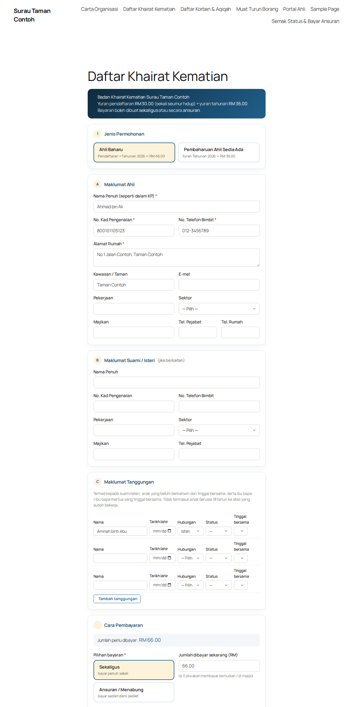
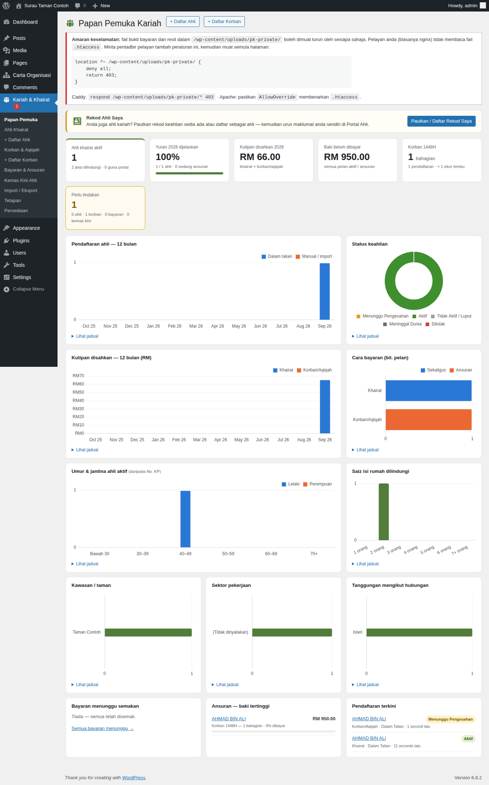
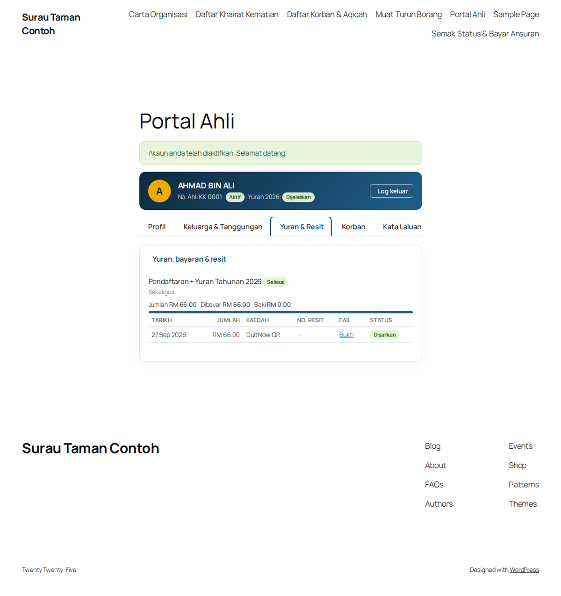

# Kariah & Khairat Masjid

Plugin WordPress untuk mengurus **ahli kariah, Badan Khairat Kematian dan Ibadah Korban/Aqiqah** masjid atau surau — pendaftaran dalam talian, rekod manual oleh AJK, bayaran sekaligus atau ansuran, Portal Ahli dan papan pemuka infografik.

*A WordPress plugin for Malaysian mosques to run death-benefit (khairat) membership and qurban/aqiqah registration: online forms with payment-proof upload, instalment plans, AJK approval workflow, member self-service portal, CSV import/export and an infographic dashboard. UI is in Bahasa Melayu; IC-number (MyKad) aware.*



## Ciri-ciri

**Untuk orang awam**
- Borang **Daftar Khairat** (ahli baharu / pembaharuan / tunggakan) dan **Daftar Korban & Aqiqah** (peserta, bahagian, agihan daging, akad wakalah)
- Bayaran **sekaligus atau ansuran** (2–36 bulan), muat naik bukti bayaran (JPG/PNG/PDF), kod QR & akaun bank masjid
- **Semak Status & Bayar Ansuran** dengan No. KP + No. Telefon
- **Portal Ahli** — log masuk dengan No. KP; lihat yuran, resit rasmi, tanggungan; kemas kini maklumat hubungan terus, perubahan pasangan/tanggungan melalui kelulusan AJK

**Untuk AJK (wp-admin)**
- Papan pemuka dengan infografik (pendaftaran, kutipan, umur, kawasan, sektor, isi rumah)
- Senarai ahli dengan tapisan, kelulusan pukal, borang A4 boleh cetak, jana yuran tahunan
- Sahkan / tolak bayaran, muat naik resit rasmi, pelan ansuran per rekod
- Senarai peserta korban (7 bahagian seekor) boleh cetak
- Import dari Google Form / CSV (dengan larian percubaan), eksport CSV
- Peranan **AJK Kariah** (akses menu ini sahaja) dan **Ahli Kariah** (portal sahaja)
- Pengasingan tugas: AJK tidak boleh mengesahkan bayaran atau perubahan rekod sendiri
- Log audit setiap perubahan rekod ahli

**Keselamatan**
- Bukti bayaran disimpan di luar Media Library (`uploads/pk-private/`) dan hanya dihantar melalui pautan bernonce selepas semakan pemilikan
- Semakan kandungan fail (bukan sekadar sambungan nama), had cubaan per IP, honeypot & masa minimum isi borang
- Mesej status melalui token pelayan (tiada teks dari URL), perlindungan formula CSV, No. KP tidak pernah muncul dalam URL
- Amaran automatik jika folder bukti boleh diakses umum (cth. nginx yang tidak membaca `.htaccess`)

| Papan pemuka | Portal Ahli |
|---|---|
|  |  |

## Pemasangan

1. Muat turun **`kariah-khairat.zip`** dari halaman [Releases](../../releases/latest).
2. wp-admin → **Plugins → Add New → Upload Plugin** → pilih zip → **Install Now** → **Activate**.
3. Ikut **Kariah & Khairat → Persediaan**:
   - **Tetapan** — nama & alamat masjid, yuran, harga bahagian korban, akaun bank, imej QR, kawasan, terma & syarat, warna
   - **Cipta halaman** — lima halaman dicipta automatik dengan shortcode yang betul
   - Tambah halaman ke menu (Penampilan → Menu / Editor Tapak)
4. Cipta akaun AJK dengan peranan **AJK Kariah**.

Kemas kini seterusnya akan muncul di **Dashboard → Updates** seperti plugin biasa.

### Shortcode

| Shortcode | Fungsi |
|---|---|
| `[pk_borang_khairat]` | Borang pendaftaran / pembaharuan khairat |
| `[pk_borang_korban]` | Borang korban & aqiqah |
| `[pk_semak]` | Semak status & hantar bukti ansuran |
| `[pk_portal]` | Portal Ahli (log masuk / aktifkan akaun) |
| `[pk_muat_turun ids="12,13"]` | Senarai borang PDF untuk dimuat turun |

## Penting: nginx

Pada pelayan **Apache/LiteSpeed**, folder bukti dilindungi automatik dengan `.htaccess`. Pada **nginx**, tambah:

```nginx
location ^~ /wp-content/uploads/pk-private/ {
    deny all;
    return 403;
}
```

Plugin akan memaparkan amaran merah di Tetapan dan Papan Pemuka jika folder ini masih boleh diakses.

## Tetapan lain

- **Sumber alamat IP** — pilih *Cloudflare* hanya jika pelayan menerima trafik dari Cloudflare sahaja.
- **Font Awesome** — ikon dimuatkan dari jsDelivr (dengan SRI) jika tema belum memuatkannya; boleh dimatikan.
- **E-mel** — notifikasi kepada AJK memerlukan laman web yang boleh menghantar e-mel (plugin SMTP).
- Ubah senarai pilihan (hubungan, sektor, kaedah bayaran) dengan penapis `pk_labels`.

## Keperluan

WordPress 6.4+ · PHP 8.0+ · MySQL/MariaDB

Disyorkan: plugin keselamatan dengan pengesahan dua langkah (2FA) untuk akaun AJK — sistem ini menyimpan No. KP dan alamat ahli (PDPA).

## Menyahpasang

Nyahaktif atau padam plugin **tidak** memadam rekod ahli secara lalai. Untuk membuang semua data (jadual, fail bukti, akaun portal ahli) semasa memadam plugin, tandakan **Tetapan → Nyahpasang** dahulu.

## Berpindah dari binaan khusus (Perepat Kariah)

Data dan tetapan dikongsi (`wp_pk_*`, `pk_settings`). Nyahaktifkan plugin lama, pasang dan aktifkan plugin ini, kemudian semak **Tetapan** untuk medan baharu (nama masjid, terma, warna).

## Lesen

GPL-2.0-or-later © Mohd Nordin Hussain · Chart.js (MIT) dibundel dalam `assets/vendor/`.
